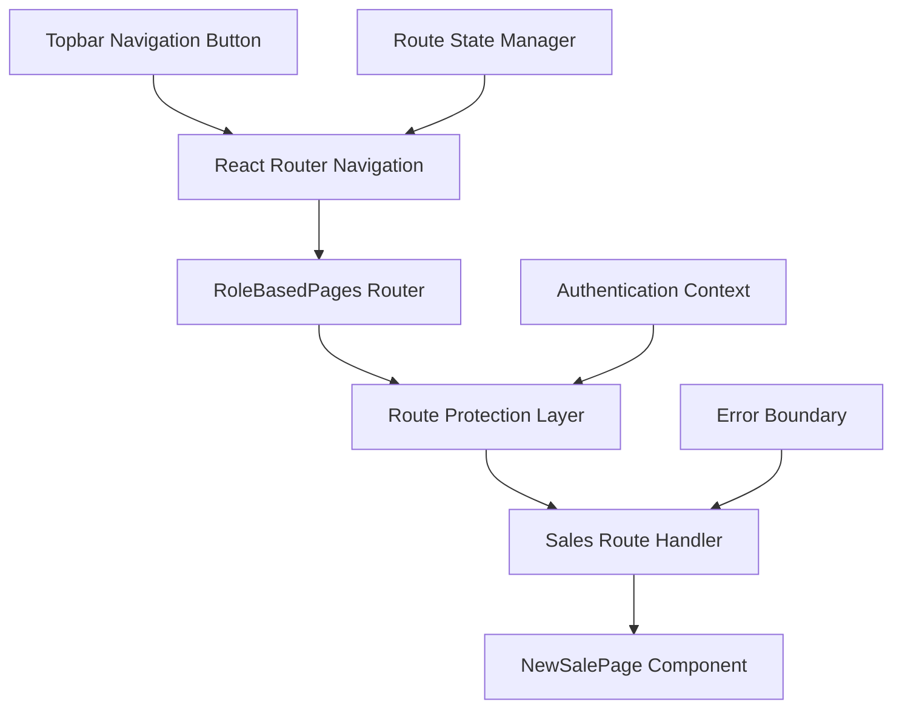

# Design Document: Sales Route Management

## Overview

This design implements a comprehensive sales routing system that enables navigation to sales-related pages from the topbar navigation button using the existing dynamic routing infrastructure. The system leverages the current `/app/:model/:view` and `/app/:model/:view/:id` route patterns while maintaining proper state management, route protection, and error handling.

The design focuses on enabling the `/sales/new` route by mapping it to the dynamic route pattern `/app/sales/new` and ensuring the DynamicPage component can properly handle sales-specific routing and state management. This approach maintains consistency with the existing dynamic routing architecture while providing the specific functionality needed for sales navigation.

## Architecture

The sales route management system follows a layered architecture:



### Key Architectural Principles

1. **Separation of Concerns**: Navigation logic, route protection, and component rendering are handled by separate layers
2. **State Management**: Navigation state is preserved across route transitions using React Router's state mechanism
3. **Error Handling**: Comprehensive error boundaries and fallback mechanisms
4. **Integration**: Seamless integration with existing RoleBasedPages and dynamic routing systems

## Components and Interfaces

### 1. Enhanced RoleBasedPages Router

The main routing component will be updated to include sales routes:

```typescript
interface SalesRouteConfig {
  path: string;
  component: React.ComponentType;
  protected: boolean;
  stateRequired?: boolean;
}

interface RouteState {
  fromTopbar?: boolean;
  from?: string;
  [key: string]: any;
}
```

### 2. Navigation State Manager

Handles state preservation and navigation logic:

```typescript
interface NavigationState {
  fromTopbar: boolean;
  from: string;
  timestamp: number;
}

interface NavigationManager {
  navigateToSales(state: NavigationState): void;
  getNavigationState(): NavigationState | null;
  clearNavigationState(): void;
}
```

### 3. Route Protection Service

Manages authentication and authorization for sales routes:

```typescript
interface RouteProtection {
  isAuthenticated(): boolean;
  hasPermission(route: string): boolean;
  redirectToLogin(): void;
  redirectToUnauthorized(): void;
}
```

### 4. Sales Route Components

Enhanced components that handle route-specific logic:

```typescript
interface SalesPageProps {
  navigationState?: NavigationState;
  routeParams?: Record<string, string>;
}
```

## Data Models

### Navigation State Model

```typescript
interface NavigationState {
  fromTopbar: boolean;        // Indicates navigation originated from topbar
  from: string;              // Previous route path
  timestamp: number;         // Navigation timestamp
  metadata?: {               // Optional metadata
    userAction?: string;
    context?: Record<string, any>;
  };
}
```

### Route Configuration Model

```typescript
interface RouteConfig {
  path: string;              // Route path pattern
  component: string;         // Component name to render
  protected: boolean;        // Requires authentication
  roles?: string[];          // Required user roles
  stateValidation?: {        // State validation rules
    required: string[];
    optional: string[];
  };
}
```

## Correctness Properties

*A property is a characteristic or behavior that should hold true across all valid executions of a system-essentially, a formal statement about what the system should do. Properties serve as the bridge between human-readable specifications and machine-verifiable correctness guarantees.*

Now I need to analyze the acceptance criteria to create correctness properties.

<function_calls>
<invoke name="prework">
<parameter name="featureName">sales-route-management

## Correctness Properties

*A property is a characteristic or behavior that should hold true across all valid executions of a system-essentially, a formal statement about what the system should do. Properties serve as the bridge between human-readable specifications and machine-verifiable correctness guarantees.*

Based on the prework analysis and property reflection, the following consolidated properties provide comprehensive validation coverage:

### Property 1: Navigation State Consistency
*For any* navigation to `/sales/new` from the topbar button, the navigation should include both the target route and proper state containing `fromTopbar: true` and the originating pathname.
**Validates: Requirements 1.1, 1.2, 2.1**

### Property 2: Button State Management
*For any* current location that matches `/sales/new` or starts with `/sales/edit`, the navigation button should be disabled with appropriate visual styling applied.
**Validates: Requirements 1.3, 1.4**

### Property 3: Route State Preservation
*For any* navigation containing state properties (`fromTopbar`, `from`), the routing system should preserve and make accessible all state data for the target component.
**Validates: Requirements 2.2, 2.3**

### Property 4: Access Control Enforcement
*For any* user attempting to access sales routes, the system should enforce proper authentication and authorization, redirecting unauthenticated users to login and unauthorized users to the unauthorized page, while allowing authorized users to access the sales components.
**Validates: Requirements 3.1, 3.2, 3.3**

### Property 5: Route Integration Consistency
*For any* sales route access, the routing system should integrate seamlessly with the existing RoleBasedPages structure, support both static and dynamic patterns, and properly extract and pass route parameters to components.
**Validates: Requirements 4.1, 4.2, 4.3**

### Property 6: Error Handling Robustness
*For any* error condition (invalid routes, loading failures, corrupted state), the system should handle gracefully by displaying appropriate error pages, error messages, or falling back to default values without crashing.
**Validates: Requirements 5.1, 5.2, 5.3**

## Error Handling

The system implements comprehensive error handling at multiple levels:

### 1. Route-Level Error Handling
- **Invalid Routes**: Unrecognized sales routes redirect to 404 page
- **Component Loading Failures**: Lazy-loaded components show error fallbacks
- **State Corruption**: Invalid or missing state falls back to default values

### 2. Navigation Error Handling
- **Authentication Failures**: Redirect to login with return URL
- **Authorization Failures**: Redirect to unauthorized page with context
- **Network Errors**: Show retry mechanisms with user feedback

### 3. State Management Error Handling
- **Missing State**: Provide sensible defaults for navigation state
- **Invalid State**: Validate and sanitize state before use
- **State Persistence**: Handle localStorage failures gracefully

### Error Recovery Strategies

```typescript
interface ErrorRecovery {
  // Route errors
  handleInvalidRoute(): void;
  handleComponentLoadError(error: Error): React.ComponentType;
  
  // Navigation errors
  handleNavigationFailure(error: NavigationError): void;
  handleStateCorruption(state: unknown): NavigationState;
  
  // Authentication errors
  handleAuthenticationError(): void;
  handleAuthorizationError(requiredRole: string): void;
}
```

## Testing Strategy

The testing strategy employs both unit tests and property-based tests to ensure comprehensive coverage:

### Unit Testing Approach
- **Component Testing**: Test individual route components with specific state scenarios
- **Integration Testing**: Test navigation flows between different pages
- **Error Condition Testing**: Test specific error scenarios and edge cases
- **State Management Testing**: Test state preservation and restoration

### Property-Based Testing Approach
- **Navigation Properties**: Test navigation behavior across all possible starting locations and states
- **State Management Properties**: Test state preservation across all valid state combinations
- **Access Control Properties**: Test authentication and authorization across all user types and permissions
- **Error Handling Properties**: Test error recovery across all possible error conditions

### Testing Framework Configuration
- **Framework**: Jest with React Testing Library for unit tests, fast-check for property-based tests
- **Property Test Iterations**: Minimum 100 iterations per property test
- **Test Environment**: jsdom environment for React component testing
- **Mock Strategy**: Mock external dependencies (authentication, routing) while testing core logic

### Property Test Tags
Each property-based test will be tagged with:
- **Feature: sales-route-management, Property 1**: Navigation State Consistency
- **Feature: sales-route-management, Property 2**: Button State Management
- **Feature: sales-route-management, Property 3**: Route State Preservation
- **Feature: sales-route-management, Property 4**: Access Control Enforcement
- **Feature: sales-route-management, Property 5**: Route Integration Consistency
- **Feature: sales-route-management, Property 6**: Error Handling Robustness